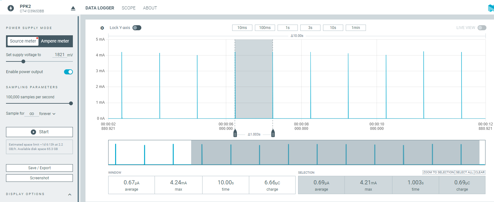
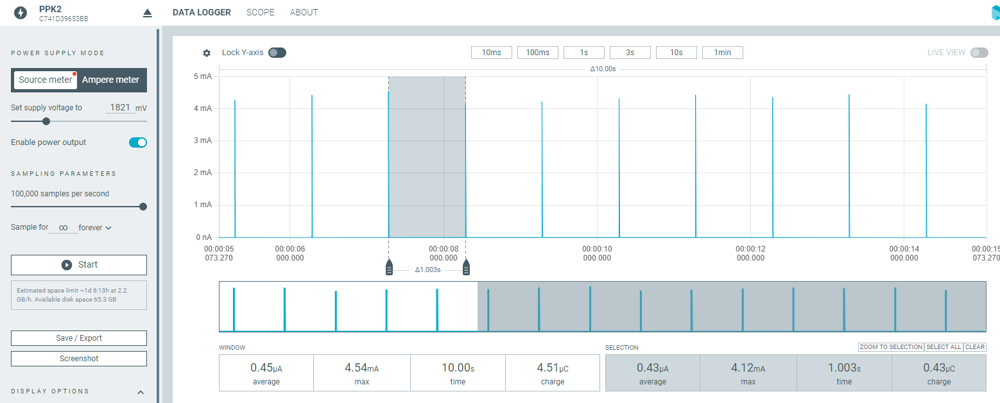

# nRF52833-SAADC-Multiplexed-Low-Power-Sampling

This repository contains two example applications for the nRF52832 Development Kit (PCA10040) demonstrating periodic, low-power analog sampling using the SAADC peripheral. Sampling is triggered by the Real-Time Counter (RTC) and utilizes an external 74HC4051 multiplexer to read from up to 8 analog inputs.

## 📦 Features

* ✅ RTC-triggered periodic sampling (low power)
* ✅ Analog multiplexer for channel expansion (8 analog inputs)
* ✅ SAADC configuration with 12-bit resolution
* ✅ Optional oversampling and burst mode
* ✅ Offset calibration support
* ✅ UART logging via SEGGER RTT
* ✅ LED indicators for sampling, buffer full, and calibration complete

## 🔧 Hardware Requirements

* [nRF52832 Development Kit (PCA10040)](https://www.nordicsemi.com/Products/Development-hardware/nrf52-dk)
* Analog Multiplexer
* Analog voltage sources (up to 3.6V when using gain 1/6)
* Optional: LEDs for visual indicators

## 🛠️ Software Details

* **SDK Version:** nRF5 SDK 17.1.0
* **SoftDevice:** Not required
* **Toolchain:** SEGGER Embedded Studio or GCC

## 📂 Structure

* `main_polling.c.txt`: Scans all MUX channels sequentially using nrf\_drv\_saadc\_sample\_convert in `perform_saadc_sample` function.
* `main.c`: Scans channels using SAADC event callback chaining.

## 📊 MUX Pin Configuration

| MUX Signal | nRF52 Pin |
| ---------- | --------- |
| S0         | P0.03     |
| S1         | P0.04     |
| S2         | P0.05     |
| EN         | P0.06     |
| AIN0       | P0.02     |

## 🔄 Sampling Strategy

* Sampling interval: 1 second (adjustable via `SAADC_SAMPLE_INTERVAL_SEC`)
* RTC is configured at 32 Hz
* Multiplexer channel is selected, then ADC is triggered after 10 µs delay

## 🧪 Calibration

* Optional offset calibration can be enabled by setting `CALIBRATION_FUNCTIONALITY_ENABLED` to `1`.
* Calibration interval adjustable via `SAADC_CALIBRATION_INTERVAL`.

## 📉 Power Consumption Comparison

The following plots were captured using the **Nordic Power Profiler Kit II (PPK2)** to compare the average current consumption between the two approaches.

| Mode                          | Average Current | Max Current | Average Charge | Plot                                     |
| ----------------------------- | --------------- | ----------- | -------------- | ---------------------------------------- |
| **main.c** (event-based)      | 0.67 µA         | 4.24 mA     | 6.66 µC        |        |
| **main\_mux\_scan\_polling/** | 0.45 µA         | 4.54 mA     | 4.51 µC        |  |

These results highlight the lower average current and charge consumption of the polling-based SAADC sampling approach.

## 📝 License

This project uses Nordic Semiconductor’s standard SDK license.

---

## 👨‍💼 Author

Created by \[Your Name], based on Nordic's SAADC example and extended for multi-channel low-power applications.

---
